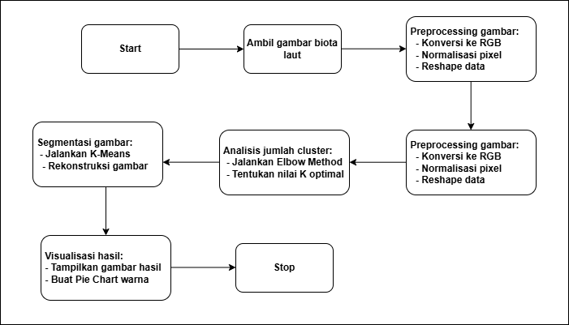

# Amarine Finall Test 
Nama : Christama Ezra Yudianto <br>
Nim : 245150307111009

## Milestone Riset Pendeteksian Objek Gambar Biota Laut

## 1. Perencanaan Awal

- Memahami dasar-dasar K-Means Clustering dan teknik pendeteksian objek.
- Mengumpulkan dataset gambar biota laut untuk eksperimen.
- Menentukan framework dan tools yang akan digunakan (OpenCV, scikit-learn, Matplotlib).

## 2. Analisis dan Desain

- Menentukan metode preprocessing gambar:
  - Konversi gambar ke RGB.
  - Normalisasi dan reshaping pixel data.
- Menggunakan **Elbow Method** untuk menentukan jumlah optimal cluster **K**.
- Merancang teknik clustering dengan K-Means untuk segmentasi warna.
- Mengembangkan metode visualisasi hasil clustering dengan Pie Chart.

## 3. Implementasi dan Pengujian

- Mengembangkan algoritma dalam Python menggunakan OpenCV dan K-Means Clustering.
- Menggunakan Elbow Method untuk menentukan nilai K terbaik.
- Menerapkan K-Means Clustering untuk segmentasi warna dalam gambar.
- Membuat visualisasi hasil clustering dalam bentuk gambar dan Pie Chart.
- Menguji algoritma pada dataset biota laut.
- Optimasi parameter K-Means untuk meningkatkan akurasi segmentasi.

## 4. Evaluasi dan Dokumentasi

- Membandingkan hasil dengan metode lain seperti DBSCAN atau Mean-Shift.
- Menulis laporan penelitian dan dokumentasi proyek di GitHub.
- Menyusun presentasi hasil riset.

## Tujuan Proyek

Proyek ini bertujuan untuk mengembangkan metode segmentasi dan analisis warna biota laut menggunakan **K-Means Clustering**. Dengan menerapkan teknik pemrosesan gambar dan pembelajaran mesin, proyek ini bertujuan untuk:
- Mengkategorikan warna dominan dalam gambar biota laut secara otomatis.
- Menganalisis distribusi warna untuk membantu identifikasi spesies biota laut.
- Mengeksplorasi efektivitas **Elbow Method** dalam menentukan jumlah optimal cluster (**K**) untuk segmentasi gambar.
- Menyediakan visualisasi hasil segmentasi menggunakan gambar yang telah diklasifikasikan dan **Pie Chart** warna dominan.
- **Menyediakan aplikasi berbasis web menggunakan Streamlit untuk mempermudah pengguna dalam melakukan analisis warna biota laut secara interaktif.**

## Diagram Alir Proses
<p align="center">
  
</p>

## Implementasi Kode dalam Python

```python
import cv2
import numpy as np
import matplotlib.pyplot as plt
import streamlit as st
from sklearn.cluster import KMeans

def elbow_method(image_path, max_k=10):
    # Membaca gambar dan mengubah ke format RGB
    image = cv2.imread(image_path)
    image = cv2.cvtColor(image, cv2.COLOR_BGR2RGB)
    
    # Ubah gambar menjadi kumpulan piksel
    pixels = image.reshape(-1, 3)
    
    # Hitung inertia untuk berbagai nilai K
    inertia = []
    k_values = range(1, max_k + 1)
    for k in k_values:
        kmeans = KMeans(n_clusters=k, n_init=10, random_state=42)
        kmeans.fit(pixels)
        inertia.append(kmeans.inertia_)
    
    # Tampilkan grafik Elbow Method
    plt.figure(figsize=(8, 5))
    plt.plot(k_values, inertia, marker='o', linestyle='-')
    plt.xlabel('Jumlah Cluster (K)')
    plt.ylabel('Inertia (SSE)')
    plt.title('Elbow Method untuk Menentukan K Optimal')
    plt.xticks(k_values)
    plt.grid()
    plt.show()

def run_streamlit():
    st.title("Pendeteksian Warna Biota Laut")
    uploaded_file = st.file_uploader("Upload gambar biota laut", type=["jpg", "png", "jpeg"])
    if uploaded_file is not None:
        st.image(uploaded_file, caption='Gambar Asli', use_column_width=True)
        st.write("Sedang menganalisis warna...")
        elbow_method(uploaded_file, max_k=10)
        st.write("Analisis selesai.")

if __name__ == "__main__":
    run_streamlit()
```

## SDLC Model: Agile

- **Sprint 1**: Studi literatur dan eksplorasi K-Means Clustering serta Elbow Method.
- **Sprint 2**: Implementasi algoritma awal, pengujian dataset kecil, dan debugging.
- **Sprint 3**: Optimasi algoritma, validasi dengan dataset lebih besar, dan analisis akurasi.
- **Sprint 4**: Dokumentasi, evaluasi, publikasi proyek di GitHub, serta penyusunan laporan riset.
- **Sprint 5**: Pengembangan aplikasi berbasis web dengan Streamlit dan deployment ke platform Streamlit Cloud.

## Tautan GitHub Proyek

[Masukkan tautan GitHub proyek di sini]

## Deployment Streamlit

Aplikasi ini dapat digunakan secara langsung melalui platform **Streamlit Cloud** untuk mempermudah analisis warna biota laut. [Masukkan tautan Streamlit di sini]

