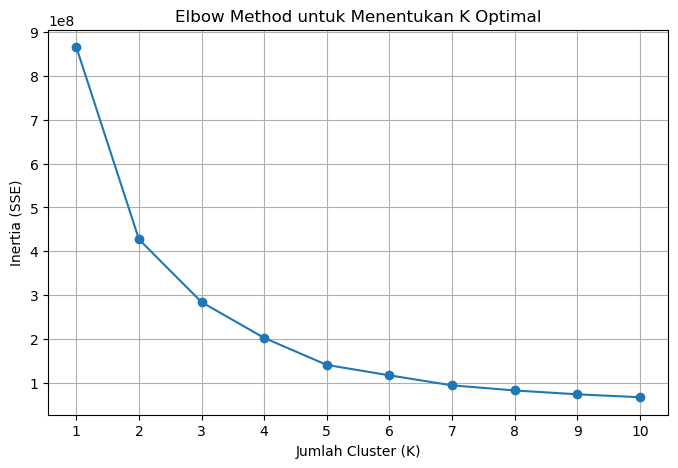
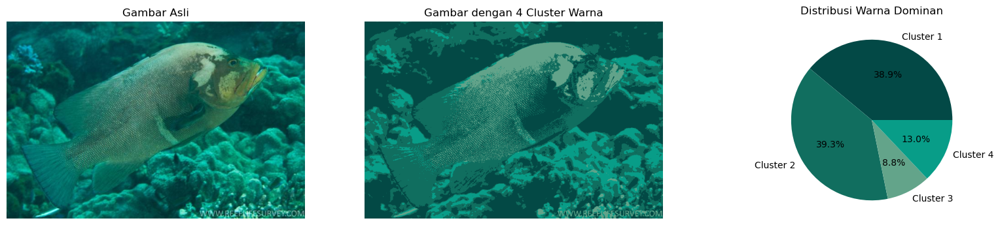
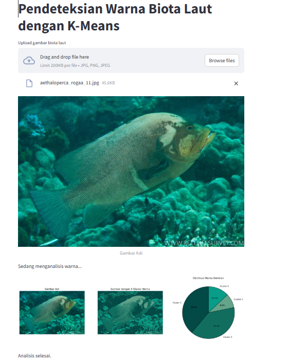

# Amarine Finall Test 
Nama : Christama Ezra Yudianto  
Nim : 245150307111009  

## Milestone Riset Pendeteksian Objek Gambar Biota Laut

## 1. Perencanaan Awal

- Memahami dasar-dasar K-Means Clustering dan teknik pendeteksian objek.
- Mengumpulkan dataset gambar biota laut untuk eksperimen.
- Menentukan framework dan tools yang akan digunakan (OpenCV, scikit-learn, Matplotlib).

## 2. Analisis dan Desain

- Menentukan metode preprocessing gambar:
  - Konversi gambar ke RGB.
  - Normalisasi dan reshaping pixel data.
- Menggunakan **Elbow Method** untuk menentukan jumlah optimal cluster **K**.
- Merancang teknik clustering dengan K-Means untuk segmentasi warna.
- Mengembangkan metode visualisasi hasil clustering dengan Pie Chart.

## 3. Implementasi dan Pengujian

- Mengembangkan algoritma dalam Python menggunakan OpenCV dan K-Means Clustering.
- Menggunakan Elbow Method untuk menentukan nilai K terbaik.
- Menerapkan K-Means Clustering untuk segmentasi warna dalam gambar.
- Membuat visualisasi hasil clustering dalam bentuk gambar dan Pie Chart.
- Menguji algoritma pada dataset biota laut.
- Optimasi parameter K-Means untuk meningkatkan akurasi segmentasi.

## 4. Evaluasi dan Dokumentasi

- Membandingkan hasil dengan metode lain seperti DBSCAN atau Mean-Shift.
- Menulis laporan penelitian dan dokumentasi proyek di GitHub.
- Menyusun presentasi hasil riset.

## Tujuan Proyek

Proyek ini bertujuan untuk mengembangkan metode segmentasi dan analisis warna biota laut menggunakan **K-Means Clustering**. Dengan menerapkan teknik pemrosesan gambar dan pembelajaran mesin, proyek ini bertujuan untuk:
- Mengkategorikan warna dominan dalam gambar biota laut secara otomatis.
- Menganalisis distribusi warna untuk membantu identifikasi spesies biota laut.
- Mengeksplorasi efektivitas **Elbow Method** dalam menentukan jumlah optimal cluster (**K**) untuk segmentasi gambar.
- Menyediakan visualisasi hasil segmentasi menggunakan gambar yang telah diklasifikasikan dan **Pie Chart** warna dominan.
- **Menyediakan aplikasi berbasis web menggunakan Streamlit untuk mempermudah pengguna dalam melakukan analisis warna biota laut secara interaktif.**

## Diagram Alir Proses
<p align="center">
  
</p>

## Implementasi Kode dalam Python 

### 1. Mengimpor Pustaka yang Dibutuhkan
```python
import cv2
import numpy as np
import matplotlib.pyplot as plt
import time
import platform
import psutil
from sklearn.cluster import KMeans
from sklearn.datasets import make_blobs
```

**Penjelasan:**
- `cv2`: Untuk membaca dan memproses gambar.
- `numpy`: Untuk manipulasi array numerik.
- `matplotlib.pyplot`: Untuk visualisasi data.
- `time`: Untuk mengukur performa algoritma.
- `platform`: Untuk mendapatkan informasi sistem operasi.
- `psutil`: Untuk memonitor penggunaan CPU dan memori.
- `sklearn.cluster.KMeans`: Untuk algoritma K-Means Clustering.
- `sklearn.datasets.make_blobs`: Untuk membuat dataset dummy.

### 2. Konversi Gambar ke Format RGB dan Ekstraksi Piksel
```python
# Membaca gambar dan mengubah ke format RGB
image_path = "images/aethaloperca_rogaa_11.jpg"
image = cv2.imread(image_path)
image = cv2.cvtColor(image, cv2.COLOR_BGR2RGB)
# Ubah gambar menjadi kumpulan piksel (flatten)
pixels = image.reshape(-1, 3)
height, width, channels = image.shape

print(f"Bentuk Awal (3D) → ({height}, {width}, {channels})")

print(f"{height} = tinggi gambar")
print(f"{width} = lebar gambar")
print(f"{channels} = jumlah kanal warna (RGB)")
print(f"Bentuk Akhir (2D) → {pixels.shape}")

```
**Output:**
```plaintext
Bentuk Awal (3D) → (432, 650, 3)
432 = tinggi gambar
650 = lebar gambar
3 = jumlah kanal warna (RGB)
Bentuk Akhir (2D) → (280800, 3)
```
**Penjelasan:**
1. Bentuk Awal (3D) → (432, 650, 3)
 - Gambar awal memiliki tinggi = 432 piksel
 - Gambar memiliki lebar = 650 piksel
 - Gambar memiliki 3 kanal warna (RGB), di mana setiap piksel 
 - memiliki tiga nilai untuk warna Merah (R), Hijau (G), dan Biru= (B)
2.  Bentuk Akhir (2D) → (280800, 3)
 - Setelah gambar diratakan (flattened), bentuknya berubah dari (432, 650, 3) menjadi (280800, 3).
 - 280800 berasal dari 432 × 650, yaitu jumlah total piksel dalam gambar.
 - Setiap piksel tetap memiliki 3 nilai warna (RGB) sehingga bentuk akhirnya menjadi (jumlah piksel, 3).

### 3. Menentukan Cluster Terbaik Dengan Elbow Method
```python
# Hitung inertia untuk berbagai nilai K
max_k = 10  # Batas atas jumlah cluster
inertia = []
k_values = range(1, max_k + 1)
for k in k_values:
    kmeans = KMeans(n_clusters=k, n_init=10, random_state=42)
    kmeans.fit(pixels)
    inertia.append(kmeans.inertia_)
    print(f"K = {k}, Inertia = {kmeans.inertia_:.2f}")
```
**Output:**
```plaintext
K = 1, Inertia = 866037899.82
K = 2, Inertia = 427127533.45
K = 3, Inertia = 283660527.88
K = 4, Inertia = 201961651.82
K = 5, Inertia = 140273876.40
K = 6, Inertia = 116479413.24
K = 7, Inertia = 93609222.28
K = 8, Inertia = 81971134.45
K = 9, Inertia = 73143205.75
K = 10, Inertia = 66512469.12
```

**Penjelasan:**
- K = jumlah klaster dalam K-Means.
- Inertia = total jarak kuadrat antara titik data dan pusat klaster.
- Semakin kecil inertia, semakin baik pemisahan klaster.
- Saat K meningkat, inertia menurun, tetapi dengan laju yang semakin lambat.
- Gunakan metode "Elbow" untuk menentukan K optimal, yaitu titik di mana penurunan inertia mulai melambat.
- Dari data, K = 4 atau K = 5 mungkin optimal.

### 4. Grafik Elbow Method untuk Menentukan K Optimal
```python
plt.figure(figsize=(8, 5))
plt.plot(k_values, inertia, marker='o', linestyle='-')
plt.xlabel('Jumlah Cluster (K)')
plt.ylabel('Inertia (SSE)')
plt.title('Elbow Method untuk Menentukan K Optimal')
plt.xticks(k_values)
plt.grid()
plt.show()
```
**Output:** <br>



**Penjelasan:** <br>
    Berasarkan **Grafik** yang ditunjukan ternyata lekukan terjadi pada Cluster ke-4.

### 5. Menggunakan K-Means untuk Segmentasi Gambar
```python
# Melakukan K-Means Clustering
kmeans = KMeans(n_clusters=4, n_init=10, random_state=42)
labels = kmeans.fit_predict(pixels)

# Buat gambar baru berdasarkan warna cluster
recolored_pixels = kmeans.cluster_centers_[labels].reshape(image.shape).astype(int)

# Menghitung Persentase Warna di Setiap Cluster
unique, counts = np.unique(labels, return_counts=True)
color_distribution = counts / counts.sum()

# Mengonversi Warna Dominan ke Format Matplotlib
dominant_colors = np.round(kmeans.cluster_centers_).astype(int) / 255

```
**Penjelasan:**
- Melakukan K-Means Clustering
    - Membagi gambar menjadi 4 klaster warna ```(n_clusters=4)```.
    - Menjalankan algoritma 10 kali untuk hasil terbaik ```(n_init=10)```.
    - Memberi label klaster pada setiap piksel gambar ```(fit_predict(pixels))```.
- Membuat Gambar Baru Berdasarkan Warna Klaster
    - Mengganti setiap piksel dengan warna pusat klaster yang sesuai.
    - Mengembalikan gambar ke bentuk aslinya ```(reshape(image.shape))```.
    - Mengubah nilai warna ke integer agar sesuai dengan format gambar.
- Menghitung Persentase Warna di Setiap Klaster
    - Menghitung jumlah piksel dalam setiap klaster ```(np.unique(labels, return_counts=True))```.
    - Mengubah jumlah piksel menjadi persentase warna dalam gambar.
-  Mengonversi Warna Dominan ke Format Matplotlib
    - Membulatkan nilai RGB pusat klaster ke bilangan bulat.
    - Mengonversi ke skala 0–1 agar kompatibel dengan Matplotlib.

### 6. Visualisasi Hasil Segmentasi Warna dengan K-Means
```python
# Gambar Asli
fig, axes = plt.subplots(1, 3, figsize=(20, 4))

axes[0].imshow(image)
axes[0].set_title("Gambar Asli")
axes[0].axis("off")

# Gambar Hasil Clustering
axes[1].imshow(recolored_pixels)
axes[1].set_title(f"Gambar dengan {k} Cluster Warna")
axes[1].axis("off")

# Pie Chart Warna Dominan
axes[2].pie(color_distribution, labels=[f"Cluster {i+1}" for i in unique], colors=dominant_colors, autopct='%1.1f%%')
axes[2].set_title("Distribusi Warna Dominan")

plt.show()
```
**Ouput:**


**Penjelasan:**
-  **Membuat Subplot untuk Visualisasi**  
     - `fig, axes = plt.subplots(1, 3, figsize=(20, 4))`  Membuat 3 kolom subplot dalam satu baris dengan ukuran 20x4.  
- **Menampilkan Gambar Asli**  
    - `axes[0].imshow(image)` Menampilkan gambar asli.  
    - `axes[0].set_title("Gambar Asli")` Memberi judul "Gambar Asli".  
-  `axes[0].axis("off")` Menyembunyikan sumbu gambar.  
    - **Menampilkan Gambar Hasil Clustering**  
    - `axes[1].imshow(recolored_pixels)` Menampilkan gambar hasil K-Means clustering.  
    - `axes[1].set_title(f"Gambar dengan {k} Cluster Warna")` Judul sesuai jumlah klaster.  
    - `axes[1].axis("off")` Menyembunyikan sumbu gambar.  
- **Menampilkan Diagram Pie Distribusi Warna**  
    - `axes[2].pie(color_distribution, labels=[f"Cluster {i+1}" for i in unique], colors=dominant_colors, autopct='%1.1f%%')` Membuat pie chart dengan warna dominan dan persentasenya.
- **Membuat pie chart dengan warna dominan dan persentasenya.**  
    - `axes[2].set_title("Distribusi Warna Dominan")` Judul untuk pie chart.  
- **Menampilkan Semua Gambar Sekaligus** 
    - `plt.show()` Menampilkan semua subplot dalam satu figure.  
- **Kesimpulan**  
    - **Gambar asli** ditampilkan untuk referensi.  
    - **Gambar hasil clustering** memperlihatkan warna dominan.  
    - **Pie chart** menunjukkan proporsi warna yang dihasilkan.

### 6. Deploy Menggunakan Streamlit
```python
import cv2
import numpy as np
import matplotlib.pyplot as plt
import streamlit as st
from sklearn.cluster import KMeans
from PIL import Image

def recolor_image_with_pie(uploaded_file):
    k = 4  

    image = Image.open(uploaded_file).convert("RGB") 
    image = np.array(image)
    
    pixels = image.reshape(-1, 3)
    
    kmeans = KMeans(n_clusters=k, n_init=10, random_state=42)
    labels = kmeans.fit_predict(pixels)
    
    recolored_pixels = kmeans.cluster_centers_[labels].reshape(image.shape).astype(int)
    
    unique, counts = np.unique(labels, return_counts=True)
    color_distribution = counts / counts.sum()
    
    dominant_colors = kmeans.cluster_centers_ / 255 

    fig, axes = plt.subplots(1, 3, figsize=(20, 7))  
    
    axes[0].imshow(image)
    axes[0].set_title("Gambar Asli")
    axes[0].axis("off")
    
    axes[1].imshow(recolored_pixels)
    axes[1].set_title("Gambar dengan 4 Cluster Warna")
    axes[1].axis("off")

    axes[2].pie(color_distribution, labels=[f"Cluster {i+1}" for i in unique], colors=dominant_colors, autopct='%1.1f%%', startangle=90, wedgeprops={'linewidth': 1, 'edgecolor': 'black'})
    axes[2].set_title("Distribusi Warna Dominan")
    
    st.pyplot(fig)

def run_streamlit():
    st.title("Pendeteksian Warna Biota Laut dengan K-Means")
    
    uploaded_file = st.file_uploader("Upload gambar biota laut", type=["jpg", "png", "jpeg"])

    if uploaded_file is not None:
        st.image(uploaded_file, caption="Gambar Asli", use_container_width=True)
        st.write("Sedang menganalisis warna...")
        recolor_image_with_pie(uploaded_file)
        st.write("Analisis selesai.")

if __name__ == "__main__":
    run_streamlit()
```
**Ouput:** <br>


### 7.Execution Time serta Kesan Pesan
```python
def get_device_info():
    return {
        "OS": platform.system(),
        "OS Version": platform.version(),
        "Processor": platform.processor(),
        "RAM": f"{round(psutil.virtual_memory().total / (1024**3), 2)} GB"
    }

def elbow_method(image_path, max_k=10):
    start_time = time.time()
    image = cv2.imread(image_path)
    image = cv2.cvtColor(image, cv2.COLOR_BGR2RGB)
    pixels = image.reshape(-1, 3)
    inertia = []
    k_values = range(1, max_k + 1)

    for k in k_values:
        kmeans = KMeans(n_clusters=k, n_init=10, random_state=42)
        kmeans.fit(pixels)
        inertia.append(kmeans.inertia_)

    exec_time = round(time.time() - start_time, 2)


    print("\n--- Informasi Eksekusi ---")
    print(f"Resolusi Gambar: {image.shape[1]}x{image.shape[0]} px")
    print(f"Bentuk gambar setelah diratakan: {pixels.shape}")
    print(f"Waktu Eksekusi Elbow Method: {exec_time} detik")

def kmeans_clustering(image_path, k=4):
    start_time = time.time()
    image = cv2.imread(image_path)
    image = cv2.cvtColor(image, cv2.COLOR_BGR2RGB)
    pixels = image.reshape(-1, 3)
    kmeans = KMeans(n_clusters=k, n_init=10, random_state=42)
    labels = kmeans.fit_predict(pixels)
    recolored_pixels = kmeans.cluster_centers_[labels].reshape(image.shape).astype(int)
    exec_time = round(time.time() - start_time, 2)


    print("\n--- Informasi Eksekusi ---")
    print(f"Resolusi Gambar: {image.shape[1]}x{image.shape[0]} px")
    print(f"Bentuk gambar setelah diratakan: {pixels.shape}")
    print(f"Bentuk gambar hasil clustering: {recolored_pixels.shape}")
    print(f"Waktu Eksekusi K-Means: {exec_time} detik")

image_path = "images/aethaloperca_rogaa_11.jpg"
elbow_method(image_path, max_k=10)
kmeans_clustering(image_path, k=4)

device_info = get_device_info()
print("\n--- Informasi Perangkat ---")
for key, value in device_info.items():
    print(f"{key}: {value}")
```
**Ouput:** <br>
```plaintext
--- Informasi Eksekusi ---
Resolusi Gambar: 650x432 px
Bentuk gambar setelah diratakan: (280800, 3)
Waktu Eksekusi Elbow Method: 17.56 detik

--- Informasi Eksekusi ---
Resolusi Gambar: 650x432 px
Bentuk gambar setelah diratakan: (280800, 3)
Bentuk gambar hasil clustering: (432, 650, 3)
Waktu Eksekusi K-Means: 1.08 detik

--- Informasi Perangkat ---
OS: Windows
OS Version: 10.0.22631
Processor: Intel64 Family 6 Model 165 Stepping 2, GenuineIntel
RAM: 31.78 GB
```
**Kesan & Pesan:** <br>
``plain text
**Suka:**
- Proyek ini memberikan pengalaman menarik dalam eksplorasi pemrosesan citra dan analisis warna menggunakan K-Means clustering.
- Visualisasi hasil segmentasi memberikan kepuasan tersendiri karena dapat melihat bagaimana gambar diubah menjadi representasi warna yang lebih sederhana.
- Proses eksplorasi dan tuning parameter memberikan kesempatan untuk memahami lebih dalam cara kerja algoritma dan dampaknya terhadap hasil akhir.
**Duka:**
- Menghadapi tantangan dalam menangani gambar berukuran besar yang memerlukan optimasi memori dan waktu komputasi.
- Menyesuaikan jumlah cluster agar menghasilkan segmentasi warna yang optimal tanpa kehilangan detail penting.
- Waktu pengumpulan yang cepat membuat proses eksplorasi dan penyempurnaan model menjadi terbatas.

```


## SDLC Model: Agile

- **Sprint 1**: Studi literatur dan eksplorasi K-Means Clustering serta Elbow Method.
- **Sprint 2**: Implementasi algoritma awal, pengujian dataset kecil, dan debugging.
- **Sprint 3**: Optimasi algoritma, validasi dengan dataset lebih besar, dan analisis akurasi.
- **Sprint 4**: Dokumentasi, evaluasi, publikasi proyek di GitHub, serta penyusunan laporan riset.
- **Sprint 5**: Pengembangan aplikasi berbasis web dengan Streamlit dan deployment ke platform Streamlit Cloud.

## Tautan GitHub Proyek & Kesan Pesan
Classsification :  <br>
Deploy Progaram : 


## Deployment Streamlit
Aplikasi ini dapat digunakan secara langsung melalui platform **Streamlit Cloud**. [Masukkan tautan Streamlit di sini]
